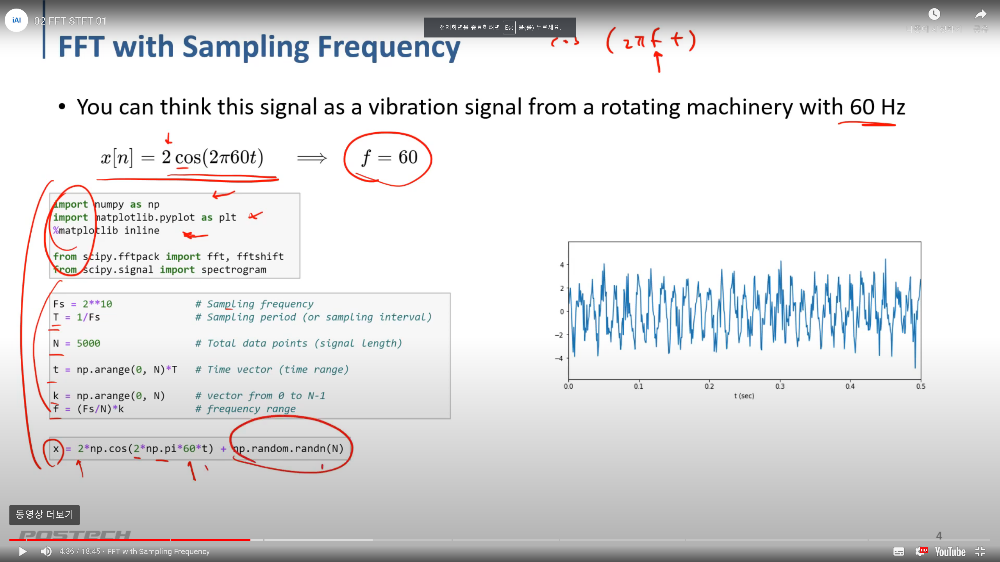
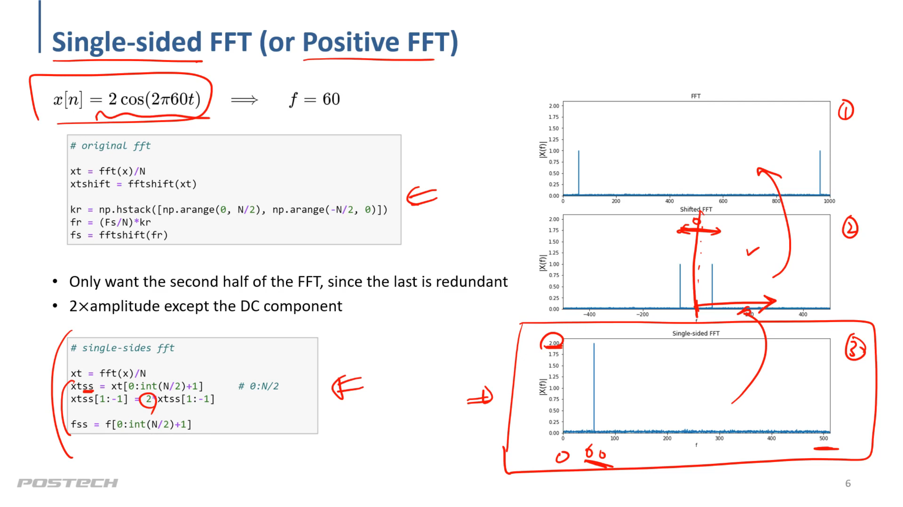
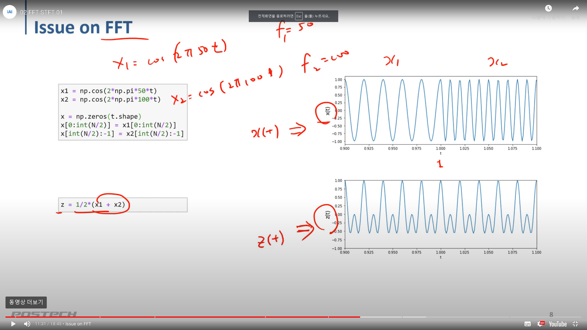

# 신호처리 (FFT and STFT)
Signal Representation by Harmonic Sinusoids

[참고]https://jbear.tistory.com/entry/STFT-Short-Time-Furier-Transform-%EC%9D%98-%EA%B8%B0%EB%B3%B8

## FFT(Fast Fourier Transform)
FFT with Smapling Frequency<br>
적은 계산량으로 이산 푸리에 변환값을 계산하는 알고리즘.

x[n] = 2cos(2*pi*60t) => f = 60 &nbsp; 60t => frequency(주기)
```python
import numpy as np
import matplotlib.pyplot as plt
%matplotlib inline

from scipy.fftpack import fft, fftshift
from scipy.signal import spectrogram

Fs = 2**10 # Sampling frequency
T = 1/Fs # Sampling period ( or sampling interval)

N = 5000 # Total data points (signal length)

t = np.arange(0, N) * T # Time vector (time range)

k = np.arange(0, N) # vector from 0 to N-1
f = (Fs/N) *k # frequency range

x = 2*np.cos(2*np.pi*60*t) + np.random.randn(N) # 신호 + 랜덤 노이즈 
```


```python
# original fft

xt = fft(x)/N
xtshift = ffshift(xt)

kr = np.hstack([np.arange(0, N/2), np.arange(-N/2, 0)])
fr = (Fs/N)*kr
fs = fftshift(fr)

# single-sides fft

xt = fft(x)/N
xtss = xt[0:int(N/2)+1]
xtss[1:-1] = 2*xtss[1:-1]

fss = f[0:int(N/2)+1]
```



```pyhton
x1 = np.cos(2*np.pi*50*t)
x2 = np.cos(2*np.pi*100*t)

x = np.zeros(t.shape)
x[0:int(N/2)] = x1[0:int(N/2)]
x[int(N/2):-1] = x2[int(N/2):-1]

z = 1/2*(x1 + x2)
```



## STFT (Short-Time Fourier Transformation)
FFT는 시간의 흐름에 따라 신호의 주파수가 변했을 때, 어느 시간대에 주파수가 변하는지 모르게 됨. 이러한 한계를 극복하기 위해서, STFT는 시간의 길이를 나눠서 퓨리에 변환을 하게됨.
