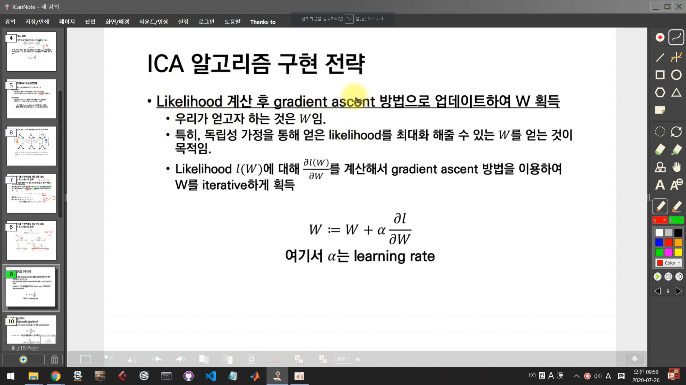
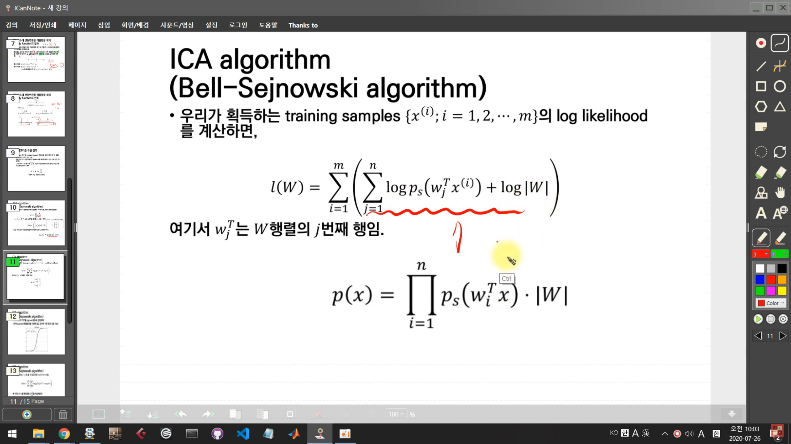
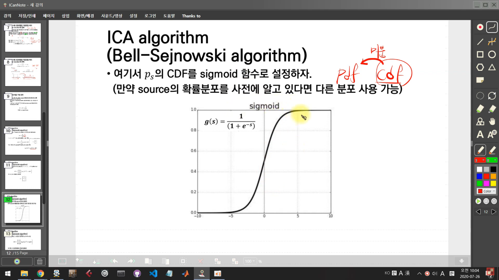
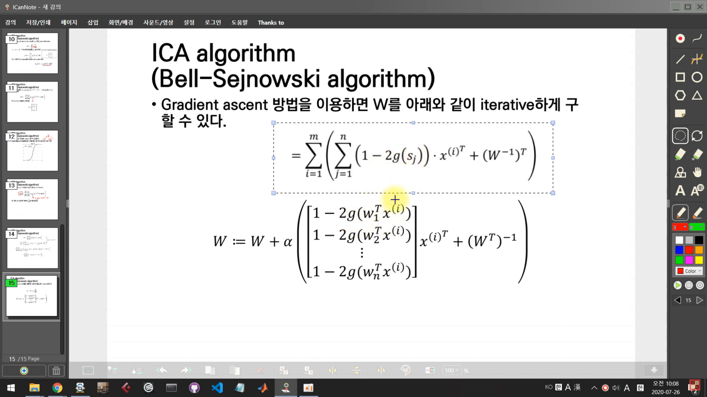

# ICA(독립성분분석)
## 필요 개념
- 중심극한정리
독립 확률 변수 n개의 평균의 분포는 n이 적당히 크다면 정규분포에 가까워진다는 정리이다.
충분히 많은 수의 iid랜덤변수의 표본평균이 정규 분포를 따른다.

- 최대우도법(MLE)
모수적인 데이터 밀도 추정방법
파라미터으로 구성된 어떤 확률밀도함수 P에서 관측된 표본 데이터 집합을
x=(x1, x2, .... ,x(n))이라 할 때, 이 표본들에서 파라미터를 추정하는 방법.


- 경사하강법
함수의 기울기(경사)를 구하고 경사의 절댓값이 낮은쪽으로 계속 이동시켜 극값에 이를 때까지 반복시키는 것이다.
모든 차원과 모든 공간에서 적용 가능.

ICA 모델과 목적
x1(t), x2(t)라고 하고, 두 사람의 음성 신호를 s1(t),s2(t)라고 하면 다음과 같은 관계로 모델링 할 수 있다.
```
x1(t) = a11*s1(t) +a12*s2(t)
x2(t) = a21*s1(t) +s22*s2(t)
x = As
```

- 이 때 우리가 원하는 것은 녹음 음원으로부터 원래 source의 음원을 분리해내는 일.
s = A^(-1)*x = W*x  # A^(-1)을 찾는 행위 => ICA

### 중심극한정리와 독립성분분석
1. 독립성분분석은 중심극한정리를 거꾸로 생각하는 것.
2. 중심극한정리
- 서로 독립적인 랜덤 변수들의 선형조합 => 가우스 분포를 따른다.
- 선형 조합에 들어가는 독립 변수들이 많을 수록 더 가우스 분포에 가까워진다.

3. 독립성분분석
- 선형조합을 통해 더 가우스 분포에 가까운 분포를 따르는 결과물들을 어떻게 조합하면 원래의 독립적인 source를 얻을 수 있을까?

=> ICA에서는 source들이 서로 독립적이라는 가정을 최대한 만족할 수 있도록 하는 W = A^(-1)을 찾는 것이 목적.

### 랜덤변수에 선형변환을 적용했을 때의 density function의 변화
- 랜덤 변수에 선형 변환을 적용 했을 때 변환 적용 전, 후 변수의 확률밀도간의 관계를 생각해보자.

- 확률밀도 함수의 전체 면적은 1이 되어야 하므로, 어떤 행렬로 랜덤 변수를 선형변환 해주면 그 확률밀도 함수는 행렬식을 이용해 보정해주어야함.

 ```
 s:[0,1]
 ps(s) = 1{0 <= s <=1}

 x:[0,2]
 px(x) =(0.5)1{0<=x<=2} |W| = |A^(-1)|

x의 확률밀도 함수:px(x)= ps(Wx)*|W| 
 ```

 - ICA 알고리즘 구현 전략
 


ICA algorithm(Bell-Sejnowski algorithm)

- 여기서 Ps의 CDF를 sigmoid 함수로 설정


