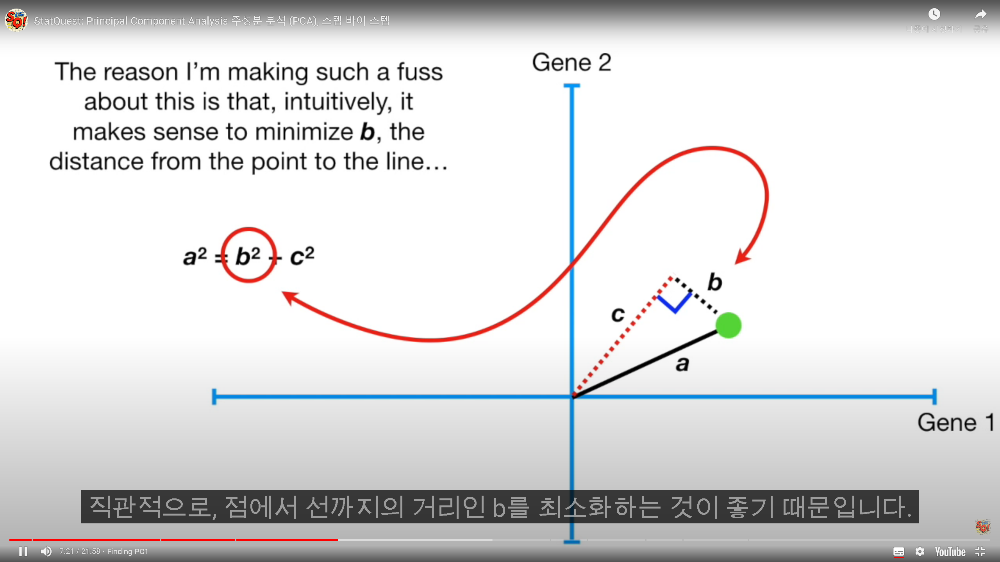
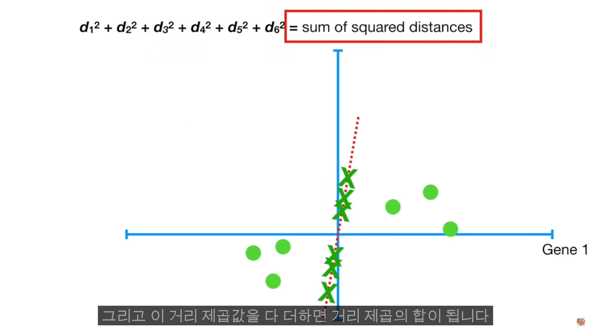
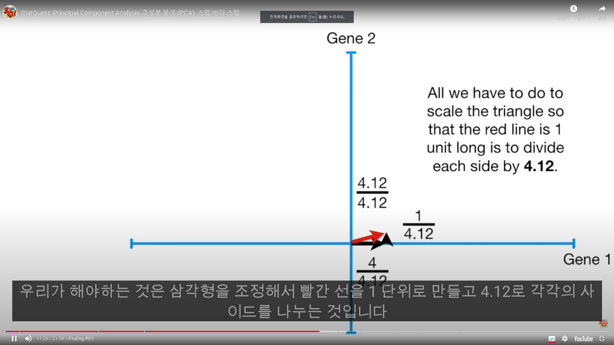
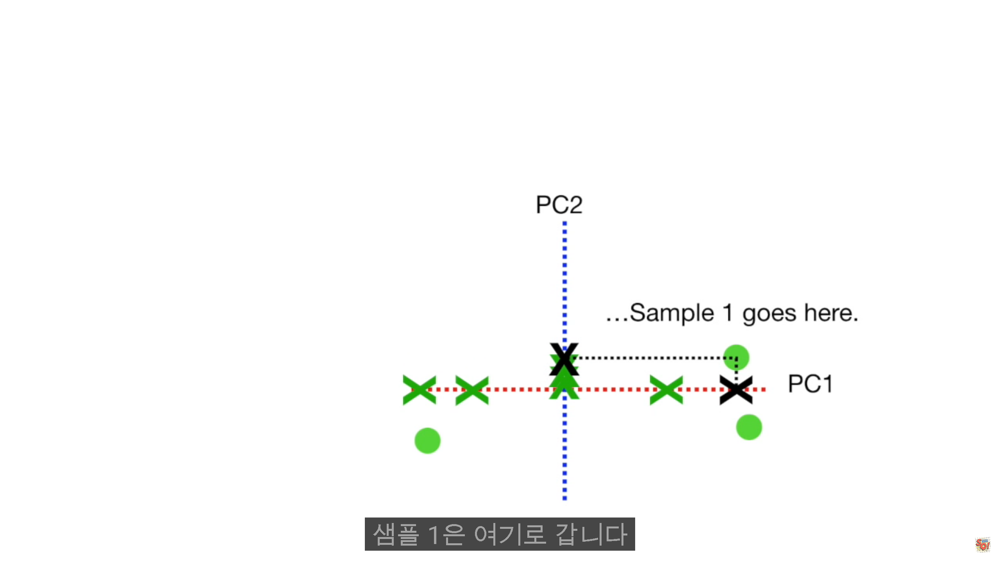

# PCA(차원축소)
- 시각화에 많이 사용함.
- 이미지 노이즈 감소
- 적은 차원의 공간에 저장
- 주성분 분석
- Eigen Vecotr는 차원수 만큼 존재한다. ex)100 차원 100개
- 가장 넓게 퍼져있는 Eigen Vector를 선택(Eigen Value가 가장 높은 값)해서 그 곳으로 데이터(점)을 모두 옮기면 PCA가 구현된다.
랜덤한 선을그린다.( 선이 데이터에 얼마나 적합한지를 정량화 하기 위해 PCA는 데이터를 투영한다.)
선에서 데이터까지의 거리를 측정하고 이 거리를 최소화하는 선을 찾음.

직관적으로 점에서 선까지의 거리인 b를 최소화하는 것이 좋음.
a의 크기는 바뀌지 않음(원점에서 점까지의 거리)
b를 최소화 하면 c의 길이는 최대화됨. a^2 = b^2 + c^2

투영된 선에서부터 원점까지의 거리제곱을 다 더한다.

a^2 = b^2 +c^2 
a,b,c /a => 1, b/a, c/a 로 만든다.

PCA가 특이값 분해를 사용하는 방식.
