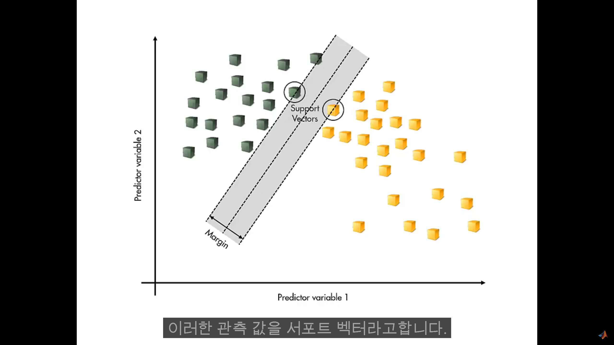

## SVM
- 관측값을 두 개의 클래스로 분류하기 쉬운 방법은 그들 사이에 선형경계를 그리는 것이다.

## SVM의 기본적인 생각.
- 경계를 각 클래스의 각 관측값에서 최대한 멀리 두는 방법
- 단순한 최적화의모습
- 선형 경계의 개수를 생각하여 마진 최대화
- 마진이란 경계와 가장 가까운 관측값 사이의 거리.
- 모든 관측 값이 경계의 올바른 범위 내에 있어야한다는 제약이 부과됨.
- 최적의 솔루션은 경계에 가장 가까운 관측 값에 의해서만 결정됨.

- 즉 모든 관측 값을 제대로 분류 할 수 있는 선형 경계가 존재하지 않음.
- SVM의 솔루션이 클래스 간 분리를 가능하게 하는 최적의 방법 중 하나.(마진을 최대화)
- 비선형 분류문제에서도 가능.
- 선형 분리가 가능하도록 변수를 변환하여 새로운 공간으로 이동시킴.
- SVM은 이진 클래스 분류에서만 작동한다.
- 다중 클래스의 분류 문제는 여러 이진 클래스 분류기를 결합하여 해결한다.