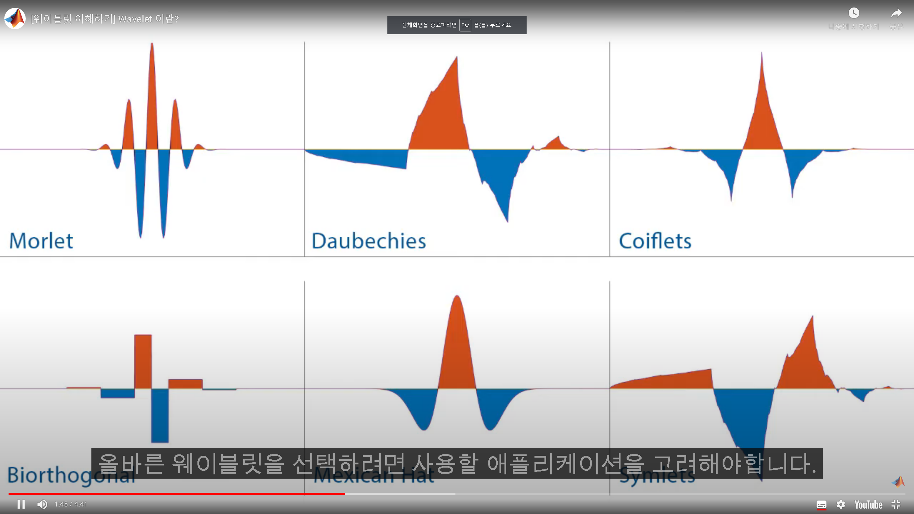

# 웨이블릿
급격한 변화가 있는 신호 및 이미지를 정확하게 분석하려면 시간과 주파수에
대해 국한되어 있는 새로운 함수클래스를 사용해야함. 
웨이블릿은 유한기간 동안 존재. 
웨이블릿은 모양과 크기가 다름.  
- 웨이블릿의 종류

## 웨이블릿 변환 개념에서 중요한 것
웨이블릿은 비례 비율이 일정한 스케일과 주파수 사이에 상호 관계가 있음.
이 비례 상수를 웨이블릿의 중심 주파수(Center Frequency)라고 함. 

- 스케일링(Scaling)
방정식을 사용하여 표현할 수 있는 시간에 따라 신호를 늘리거나 줄이는 과정.
예시로 사인파의 10Hz를 2만큼 스케일링하면 원래 주파수가 절반 또는 한 옥타브 감소함. 10Hz => 5Hz 

- 이동(Shifting)
신호 길이에 따라 웨이블릿의 시작을 지연시키거나 진행하는것. 

## 웨이블릿 분석의 두가지 주요 변환
- 연속 웨이블릿 변환
- 이산 웨이블릿 변환

## 이산 웨이블릿 변환(Discrete wavelet transform)
- 주요 응용 분야
신호 및 이미지의 노이즈 제거 및 압축

- 적은 계수로 자연 발생 신호와 이미지를 표현하는데 적합

- 서로 다른 해상도에서 점차 좁은 서브밴드에서 신호를 분석하는데 도움을 줌.

### 순서
1. 근사와 세부 계수를 얻는다.(다단계 웨이블릿 분해를 수행)
2. 세부 계수를 분석하고 적절한 임계 값을 선별.
3. 세부 계수를 임계 값으로 구분하고 신호를 재구성.

### 임계값 방식
- 범용 임계값 계산 공식(The universal threshold)
sqrt(2*log(length(X))) * median(abs(D))/ 0.6745

1. Soft Thersholding
- 임계 값보다 작은 크기의 계수는 0으로 설정
- 임계 값보다 큰 계숭에서 임계 값을 빼서 계수의 크기가 줄어듦.

2. Hard Thersholding
- 임계 값보다 작은 크기의 계수는 0으로 설정
- 임계 값보다 큰 계수는 변경되지 않음.

## 연속 웨이블릿 변환(Continuous wavelet transform)
- 주요 웨이블릿 분석
1. Morse Wavelets
2. Analytical Morlet
3. Bump Wavelet

- 주요 응용 분야
시간 주파수 분석 및 시간적으로 국부화된 주파수 성분의 필터링

- 웨이블릿의 스케일과 등가 주파수는 반비례함.

- 신호의 진동 동작을

- spectrogram() : 신호와 샘플링 주파수를 전달.
사용 예시 : spectrogram(kobe,128, [], [], Fs, 'yaxis')

- cwt() : 웨이블릿 계수와 등가 주파수를 출력으로 반환
사용 예시 : cwt(kobe, Fs, 'NumOctaves', No, 'VoicesPerOctave', Nv);