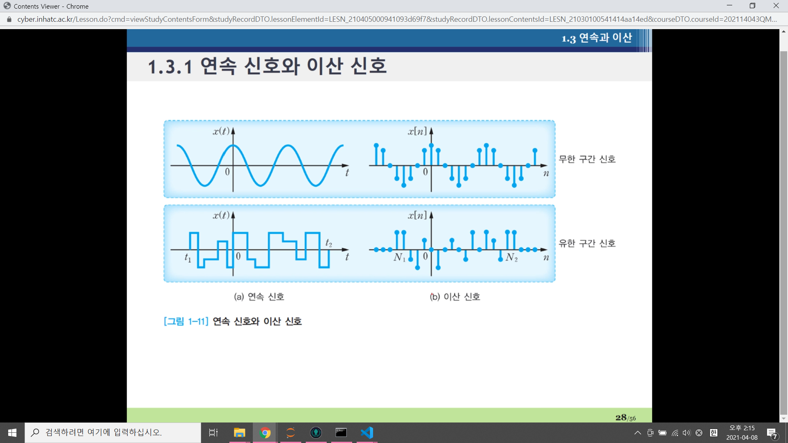
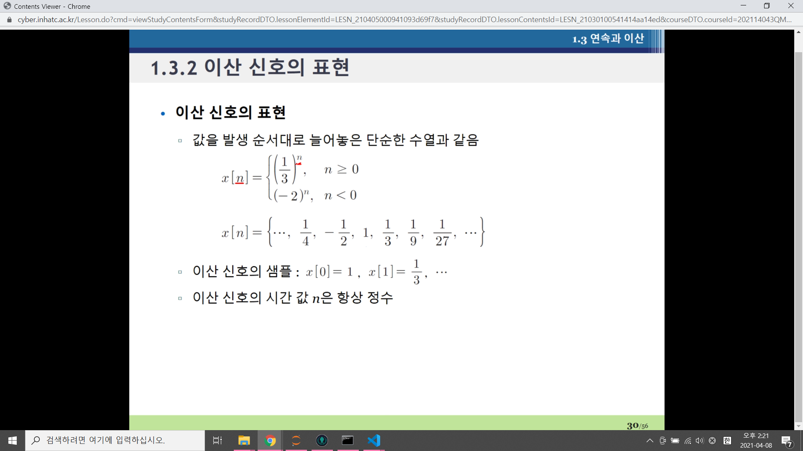
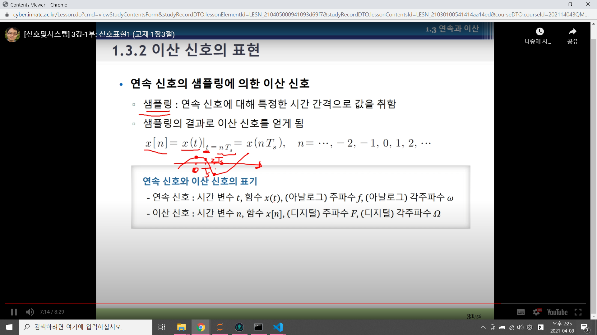

# 연속 신호와 이산 신호
1. 연속(시간) 신호 x(t)
- 시간에 대해 끊어지지 않는, 즉 모든 시간에 대해 정의되는 신호
- ex) 전압, 음성, 심전도

2. 이산(시간) 신호 x[n]
- 띄엄띄엄 특정한 시간에서만 정의되는 신호
- ex) 상품의 분기별 판매량, 매일의 주식 가격, 일병 최고온도.

3. 신호의 길이
- 연속 신호 : 신호 값이 존재하는 시간 구간의 길이 L로 정의
x(t)가 t1<= t < t2 에서 정의 -> L = t2 - t1

- 이산 신호 : 신호를 이루는 샘플의 개수 N으로 정의
x[n]이 N1 <= n <= N2 에서 정의 -> N = N2 - N1 +1

4. 유한 구간 신호와 무한 구간 신호
- 유한 구간 신호 : 시간적으로 유한한 길이를 갖는 신호
- 무한 구간 신호 : 시간적으로 무한한 길이를 갖는 신호

5. 이산 신호의 표현

- 값을 발생 순서대로 늘어놓은 단순한 수열
- 이산 신호의 시간 값 n은 항상 정수

6. 연속 신호의 샘플링에 의한 이산 신호
- 샘플링 : 연속 신호에 대해 특정한 시간 간격으로 값을 취함.
- 샘플링의 결과로 이산 신호를 얻게됨.

7. 연속 신호와 이산 신호의 표기

## 이산 신호의 표현 
- 예제

