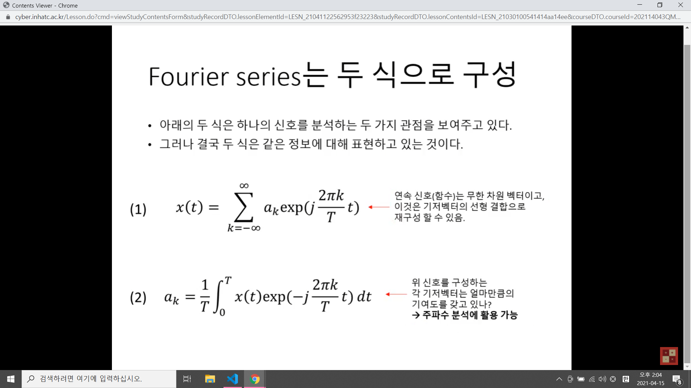
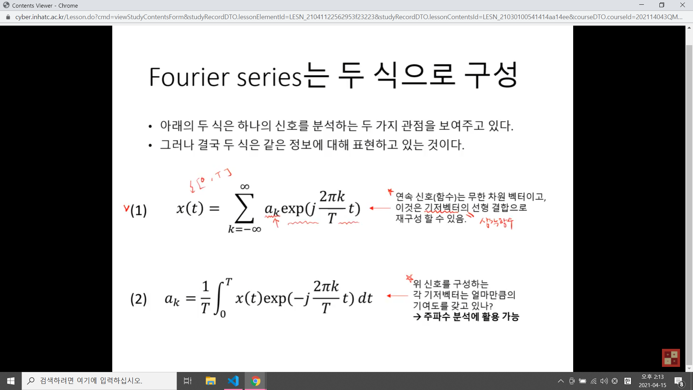
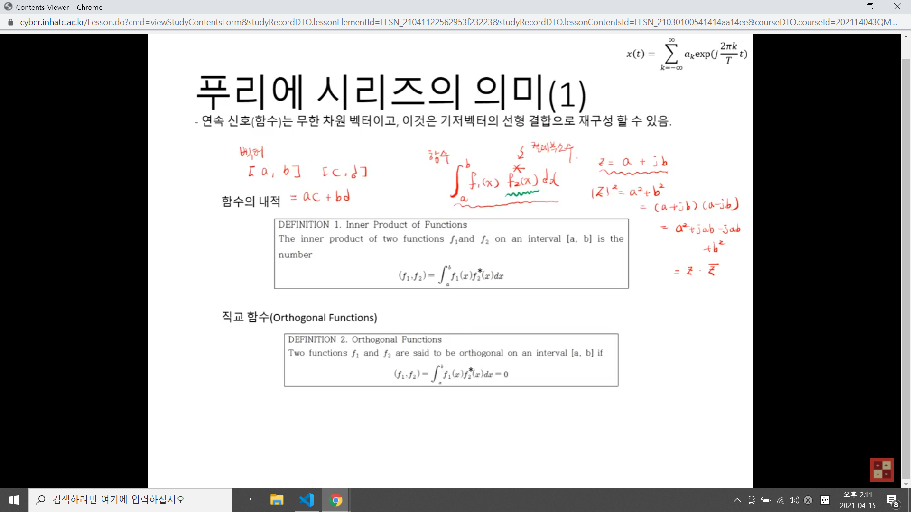
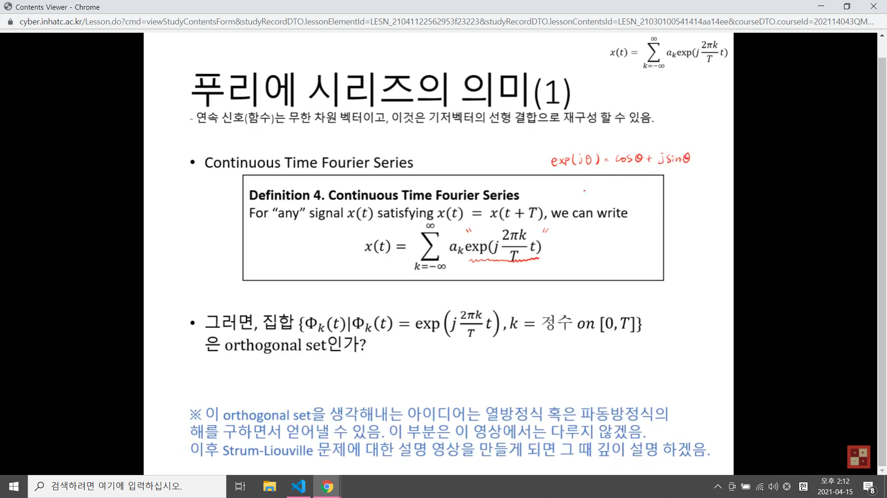
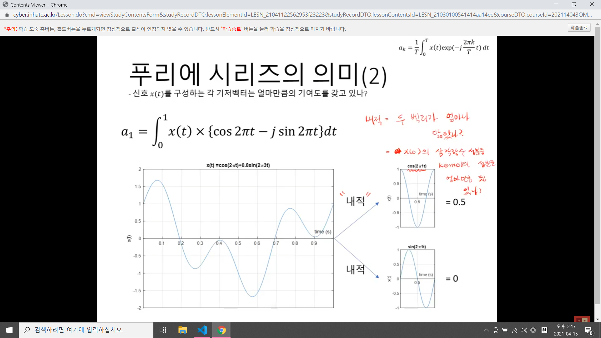
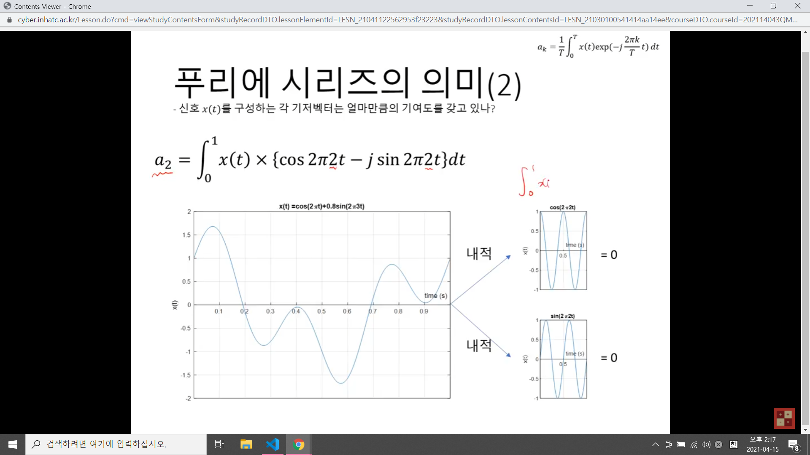
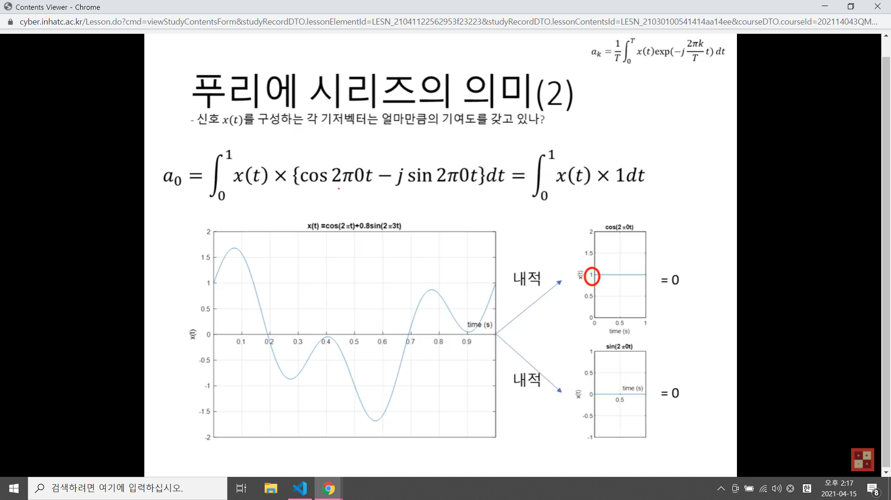
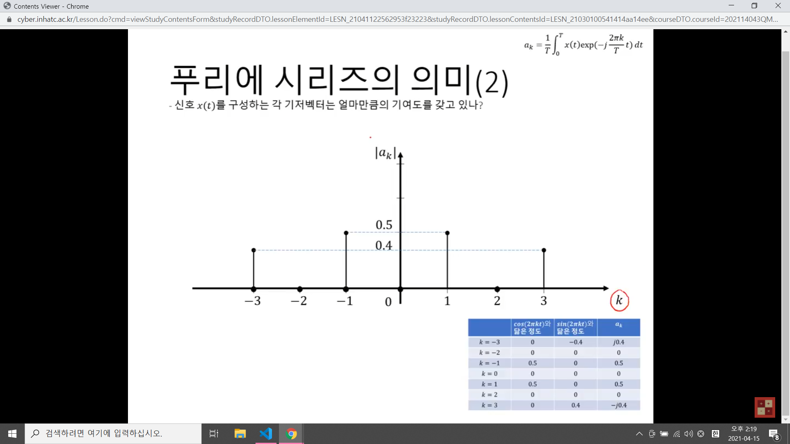
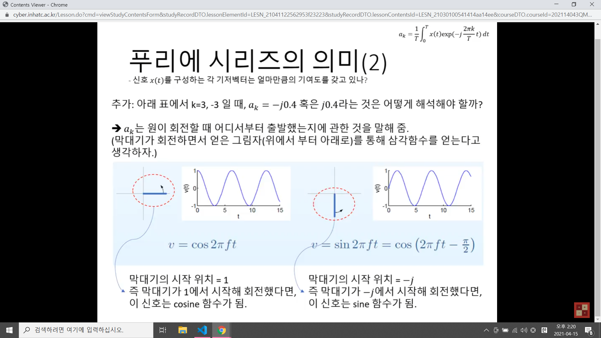
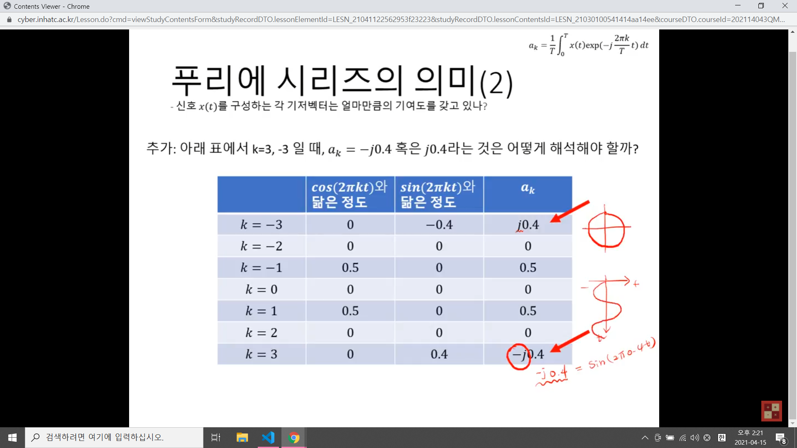

# 푸리에 급수
## Fourier seriese는 두 식으로 구성
- 아래의 두 식은 하나의 신호를 분석하는 두 가지 관점을 보여준다.

- 그러나 결국 두 식은 같은 정보에 대해 표현하고있다.

## 푸리에 시리즈의 의미
- 연속 신호(함수)는 무한 차원 벡터이고, 이것은 기저벡터의 선형 결합으로 재구성 가능하다.
1. 벡터의 직교
- vector i, j가 직교한다면?
- i와 j의 내적은 0이다.
- x축의 단위 벡터와 Y축 단위 벡터로 2차원 벡터 공간의 모든 벡터를 표현할 수 있다.
- 벡터 세 개가 직교한다면?
=> 3차원 벡터 공간의 어떠한 벡터라도 X,Y,Z의 단위벡터로 표현 가능
2. 즉, N차원 벡터 공간을 표현하기 위해서는 N개의 직교하는 벡터가 필요.

3. 함수는 일반화된 벡터로 취급할 수 있다.
4. N차원 벡터는 N개의 숫자의 나열.(튜플)
5. 실수(혹은 복소수)함수는 실수(혹은 복소수)값을 무한 개 나열한 것.
- 함수를 벡터로 표현 => [f(a).(f(a+bx)...f(b))]
6. 즉, 실수(복소수) 함수는 무한 차원 벡터라고 생각가능.
7. 일반적으로 실수(혹은 복소수)함수는 무한차원 벡터로 생각할 수 있음.
8. 그러면 무한차원의 벡터 공간을 표현해야 함.
9. 함수의 직교
- 직교하는 함수를 무한 개 찾을 수 있다면?
- 같은 구간[a,b]의 직교 함수를 이용해서 어떤 실수(혹은 복소수)함수라도 그 구간 내의 함수를 표현 가능하다.
10. 함수의 내적
 

11. 직교 함수 집합
 

## 푸리에 시리즈의 의미

- 내적 = 두 벡터가 얼마나 닮았나?

- a(k)는 복소수

## reference
[주소]https://www.youtube.com/watch?v=bzoGRbAXK-E&t=1391s
