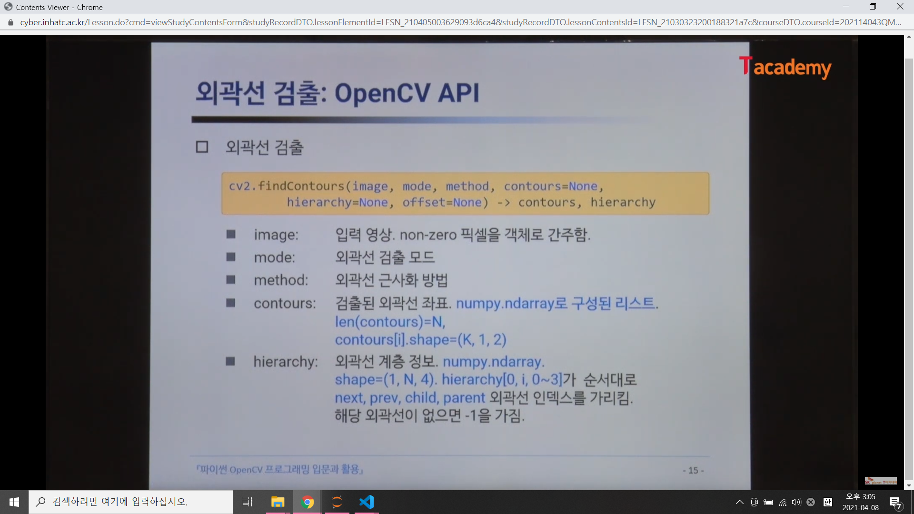

# 객체 단위 분석
1. 객체 단위 분석
- 흰색으로 표현된 객체를 분할하여 특징을 분석
- 객체 위치 및 크기 정보, ROI 추출

2. 레이블링 (Connected Component Labeling)
- cv2.connectedComponent(), cv2.connectedComponentWithStats()
- 서로 연결되어 있는 객체 픽셀에 고유 번호ㅈ 지정
- 각 객체의 바운딩 박스, 무게 중심 좌표로 함께 반환
- 영역 기반 모양 분석
- 레이블맵, 바운딩박스, 픽셀 개수, 무게중심 좌표를 반환

3. 외곽선 검출(Contour Tracing)
- 외곽선 기반 모양 분석
- 외곽선 점들의 좌표와 계층 구조를 반환
- 다양한 외곽선 처리함수에서 활용 가능(근사화, 컨벡스헐 등)
- cv2.findContours()
- 각 객체의 외곽선 좌표를 모두 검출

## 활용방안 
- 활용방안 
바운딩박스의 위치나 크기 정도만 알고 싶다 => 레이블링 
 
어떤 객체를 찾고 어떤 모양이 있거나 더 자세하게 검출하고 싶다 => 외곽선 검출

4. 자동 임계값 결정 방법 - Otsu 방법
- Otsu 방법을 이용한 자동 이진화
