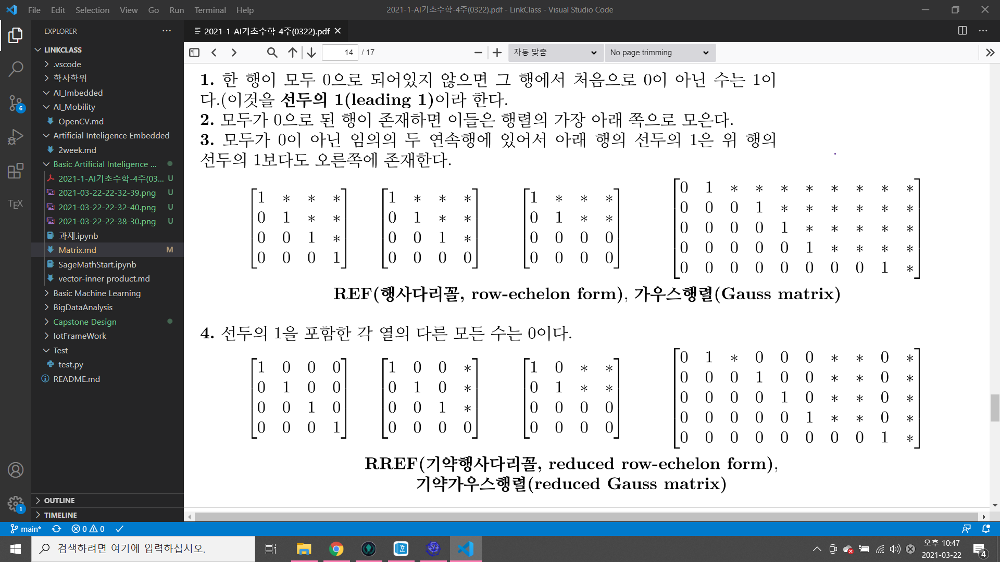

# 행렬(Matrix)
## 정의
- 수나 수식 등을 직사각형 모양으로 배열한 것.
ex) [a11, a12, a13]
    [a21, a22, a23]
    [a31, a32, a33]
- m개의 행과 n개의 열을 갖는 행렬 A를 크기가
m*n인 행렬이라고 정의, 특히 m = n인 경우 n차의
정사각행렬이라고 정의한다.
ex) m =2, n = 2 => 2차의 정사각행렬 
- 행렬 A의 i행, j열의 성분 a(ij)를 A의 (i,j) 성분이라함.

행렬 A의 i행, j열의 성분 a(ij)를 A의 (i,j) 성분이라 하며, n차 정사각행렬 A의
성분 a(11), a(22), a(nn)을 주대각선성분이라고 한다. 행렬 A는 (i,j)성분을 써서
A = [ a(ij) ]m*n

## 행렬의 특징
1. 두 행렬 A와 B의 크기가 같고 성분이 같을 때, 두 행렬 A와 B는 같다고 정의. A=B로 표기한다.
2. 크기가 같은 두 행렬 A와 B를 더한 행렬 A+B의 성분을 두 행렬 A와 B의 같은 위치에 있는 성분끼리 더하여 정의한다.
3. 행렬 A에 스칼라 c를 곱한 cA의 성분들은 행렬 A의 모든 성분에 c를 곱하여 정의함.
4. 크기가 같은 행렬 A와 B는 교환법칙, 결합법칙, 항등원을 갖는다.
- A + B = B + A(o)
- (A + B) + C = A + (B + C)(o)
- A + 0 = A(o)
- A + (-A) = 0
5. 행렬 A와 B가 서로 곱할때 행렬 A*B(i,j)의 성분을 구하려면
A의 i행 벡터와 행렬 B의 j열 벡터의 내적으로 정의한다.
6. 행렬 A,B,C가 각 연산이 정의될 수 있는 적당한 크기 행렬, a,b가
스칼라인 경우 다음이 성립한다.
A+B = B+A (교환법칙)덧셈
A+(B+C) = (A+B)+C (결합법칙)덧셈
A(BC) = (AB)C (결합법칙)덧셈
A(B+C) = AB + AC(분배법칙)
(B+C)A = BA + CA(분배법칙)
a(B+C) = aB + aC
(a+b)C = aC + bC
(ab)C = a(bC)
a(BC) = (aB)C = B(aC)
1A = A
임의 행렬 A와 영행렬 O에 대하여
A + O = O + A = A
A - A = O
O - A = -A
AO = OA = O
```M

[Input]
# Example3
A=matrix(2,3,[2,3,4,1,3,1]); B= matrix(2,3,[0,2,7,-1,3,-5]); C= matrix(2,3,[9,-6,3,3,0,12]);
2*A-B+C/3
[Output]
[ 7  2  2]
[ 4  3 11]
# Example4
A=matrix(2,3,[2,3,4,1,3,1]); B= matrix(3,3,[0,2,7,-1,3,-5,1,2,3]); C= matrix(3,2,[9,-6,3,0,1,3]);
print("AB =",A*B)
print("AC =",A*C)
print("CA =",C*A)
# print("BA =",B*A) = 불가능
print("BC =",B*C)
# print("CB =",C*B) = 불가능
# Example5
A = matrix(3,3,[2,4,5,-4,7,-9,2,0,-9])
b = vector([4,5,1])
print("[A|b] =\n",A.augment(b))
print("[A|b] =\n",A.augment(b,subdivide=True))
```
## 선형계 또는 선형연립방정식
- A*x = b => x(1)A^(1) + x(2)A^(2)....
- A ==(계수행렬) x == (해백터) 
- 확대행렬에는 선형연립방정식의 모든 정보가 들어있음.
- b!=0일 때, 주어진 선형연립방정식을 비제차라 함.
- b=0일 때, 주어진 선형연립방정식을 제차라한다.

# 선형 연립 방정식
1. 해의 조건
- 유일한 해를 갖는다.
- 무수히 많은 해를 각는다.
- 해를 갖지 않는다.

2. 연산 적용
- 두 방정식을 교환.
- 하나의 방정식의 양변에 0이 아닌 상수를 곱한다.
- 상수가 곱해진 방정식을 다른 방정식에 더한다.
x + y + 2z = 9
2x + 4y - 3z = 1
3x + 6y - 5z = 0

2x + 2y + 2z = 18
2x + 4y - 3z = 1
-2y+5z =17

3x + 3y + 6z = 27
3x + 6y - 5z = 0
3y - 11z = -27


## 확대행렬(argmented matrix)
### 기본행연산
1. 두 행을 교환한다.
2. 한 행에 0이 아닌 상수를 모두 곱한다.
3. 한 행에 0이 아닌 상수를 곱하여 다른 행에 더한다.

### 후진대입법

1. -2R(1) + R(2) # 2행 1열을 소거해서 0으로 만들어준다.
2. -3R(1) + R(3) # 3행 1열을 소거해서 0으로 만들어준다.
3. 1/2*R(2) # 2행을 1/2 해서 3행과 소거하기 쉬운 형태로 만들어준다.
4. -2*R(2) + R(3) # 3행 2열을 소거해서 0으로 만들어준다.
5. -2*R(3) # 남은 3행을 -2배해주면 z=3 이라는 해를 얻을 수 있다.

### 가우스 소거법
REF와 후진대입법을 이용하여 연립방정식을 푸는 것을 Gauss 소거법이라 한다.
RREF와 후진대입법을 이용하여 연립방정식을
푸는 것을 Gauss-Jordan 소거법.

- 행렬 A에 기본행연산을 유한번 실시하여 얻어진 행렬을 B라 하면
A와 B는 행동치라 한다.
A = matrix(2,2,[1,2,3,4]), B = matrix(2,2,[3,4,1,2])
### 가우스 행렬
1. 한 행이 모두 0으로 되어 있지 않으면 그 행에서 처음으로 0이 아닌 수는 1이다.(이것을 선두의 1(leading 1)이라 정의한다.)
2. 모두가 0으로 된 행이 존재하면 이들은 행렬의 가장 아래쪽으로 모은다.
3. 모두가 0이 아닌 임의의 두 연속행에 있어서 아래 행의 선두의 1은
위 행의 선두의 1보다도 오른쪽에 존재한다.
- REF(행사다리꼴, 가우스행렬)
4. 선두의 1을 포함한 각 열의 다른 모든 수는 0이다.
- RREF(기약행사다리꼴, 기약가우스 행렬)


- 선두변수
RREF에서 선두의 1에 해당하는 변수를 선두변수.
- 자유변수
선두의 1에 해당하지 않는 변수를 자유 변수라함.
[컴퓨터의&nbsp;계산법]RREF와 후진대입법을 이용하여 연립방정식을
푸는 것을 Gauss-Jordan 소거법.
### 비동차 방정식과 동차 방정식
1. 비동차 방정식
- AX=B인 경우 (B!=0)
ex) x(0),x(kernel)이 해라고 가정.
A(X(0)+X(k)) = B 또한 해집합에 포함됨.
- 풀이방법 : <br>
해를 가지고 있는 열벡터를 활용해 확대행렬을 만든다.<br>
확대행렬을 만든 행렬에 rref행렬을 만든다.<br>
rref행렬을 자유변수와 상수항의 열벡터로 나타낸다.
- rref상태의 비동차 연립방정식의 해는<br>
자유변수와 상수항의 열벡터로 나타내어질 수 있다.
2. 동차 방정식
- AX=0인 경우 (B==0)
- 해집합이 벡터스페이스를 이룬다.
- ex) x(1),x(2)가 해집합의 원소라고 가정
AX(1) =0 / AX(2) = 0 
X = 0 은 등식을 만족시키기 때문에 해는 맞음
하지만 X = 0 이라는 해의 의미가 부족하기 때문에 이런 해를 자명해라고 지칭함
동차방정식의 목표는 'non-trivial solution'을 찾는 것이 목표.
X라는 벡터에 행렬 A를 곱할시 0이된다.
솔루션의 집합은 Kernel of A
즉 커널이 벡터스페이스이고, 동차방정식의 특징은 해의 집합이 벡터스페이스라는것.


