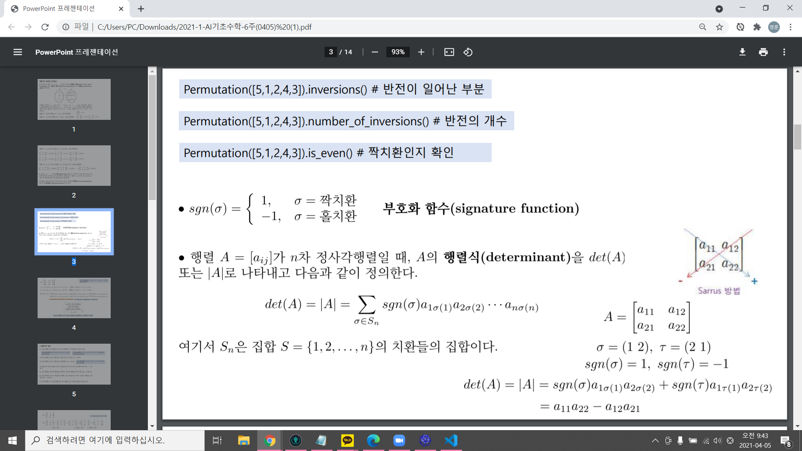

# 행렬식의 정의와 기본 정리
- 자연수의 집합 S = {1, 2..... n}에서 S로의 일대일 대응 혹은 전단사 함수를 S의 치환이라함.
- S = {1,2,3}의 치환은 3! = (1)(2)(3) = 6개 존재.
- 치환에서 반전이란 큰 자연수가 작은 자연수보다 더 왼쪽에 먼저 나타나는 경우를 말함. 예시로, 치환 (1 4 2 3)에서 4는 2보다, 3보다 더 왼쪽에 있으므로 반전이 2번 일어났다.
- 치환이 가진 반전의 총 개수가 짝수이면 이 치환은 짝치환, 홀수이면 홀치환이라 한다.
- Permutation([5,1,2,4,3]).inversions # 반전이 일어난 부분
- Permutation([5,1,2,4,3]).number_of_inversions() # 반전의 개수
- Permutation([5,1,2,4,3]).is_even() # 짝치환인지 확인
- sgn(시그마) = {1, 시그마= 짝치환, / -1, 시그마 = 홀치환} => 부호화 함수(signature function)
- 행렬 A가 n차 정사각행렬일 때, A의 행렬식을 det(A)또는 |A|로 나타내고 다음과 같이 정의한다.

# Sarrus 방법
 a13[a11 a12 a13]a11
    [a21 a22 a23]
 a33[a31 a32 a33]a31
 => 왼쪽부터 아래로 대각선 3개 - 오른쪽부터 아래로 대각선 3개
 => a11*a22*a33 + a12*a23*a31 + a13*a21*a32
 - a11*a23*a32 + a12*a21*a33 + a13*a22*a31

 - 정사각행렬 A가 삼각행렬이면 A의 행렬식은 주대각성분의 곱과 같다.
 삼각행렬 = 대각원소 밑의 원소가 모두 0인 행렬.

