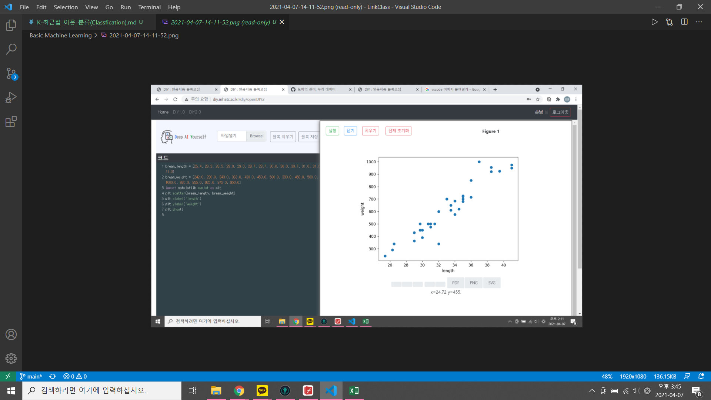

# K-최근접 이웃 분류(Classfication) - KNN (지도학습의 일종)
1. 어떤데이터에 대한 답을 구할 때 주위의 다른 데이터를 보고 다수를 차지하는 것을
정답으로 함.

## 알고리즘
1. 점 A와 기존의 data사이의 거리(d)를 측정. 거리 측정은 Manhattan distance/
Euclidean distance / Minkowski distance를 사용한다.
2. 측정한 거리가 작은 순으로 k개의 점을 찾는다.
3. K개의 점이 속한 클래스를 찾는다.
4. K개의 점이 속한 클래스가 가장 많은 클래스를 찾는다. (다수결의 원칙)
5. 점 A를 다수결의 원칙을 통해 클래스를 분류한다.
6. 시험 데이터로 평가한다.

## 사이킷런(Scikit-learn) k-최근접 이웃

```python
import sklearn
kn = sklearn.neighbors.KNeighborsClassifier()
```

```python
from sklearn.neighbors import KNeighborsClassifier
kn = KNeighborsClassifier() # 클래스 객체 생성, 모델 생성
kn.fit(fish_data, fish_target) # 훈련
kn.score(fish_data, fish_target) # 평가 => 정확도(accuracy) 1.0 도미 / 빙어 분류 100%
```

## 전통적인 프로그램
- 규칙을 통해 정의하는 프로그램
- 규칙기반으로 정의하는게 효율적인 경우 규칙기반으로 정의한다.

## 머신러닝
1. 특성
- 비용대비 효과를 따져야한다.
- 데이터가 많이 정리되어 있어야 한다.
- 머신러닝 = 변수
- 도미의 크기를 학습하고 도미인지 빙어인지 구분. 

2. 흐름
데이터, 길이, 무게, 종류 =>(훈련) => ML Model
판별할 상품 => ML Model => 판별.

### 도미 실습
1. 산점도 실습
- 특징점을 무엇으로 할지에 대한 생각.

```python
# 도미 데이터
bream_length = [25.4, 26.3, 26.5, 29.0, 29.0, 29.7, 29.7, 30.0, 30.0, 30.7, 31.0, 31.0, 31.5, 32.0, 32.0, 32.0, 33.0, 33.0, 33.5, 33.5, 34.0, 34.0, 34.5, 35.0, 35.0, 35.0, 35.0, 36.0, 36.0, 37.0, 38.5, 38.5, 39.5, 41.0, 41.0]
bream_weight = [242.0, 290.0, 340.0, 363.0, 430.0, 450.0, 500.0, 390.0, 450.0, 500.0, 475.0, 500.0, 500.0, 340.0, 600.0, 600.0, 700.0, 700.0, 610.0, 650.0, 575.0, 685.0, 620.0, 680.0, 700.0, 725.0, 720.0, 714.0, 850.0, 1000.0, 920.0, 955.0, 925.0, 975.0, 950.0]
# 빙어의 데이터
smelt_length = [9.8, 10.5, 10.6, 11.0, 11.2, 11.3, 11.8, 11.8, 12.0, 12.2, 12.4, 13.0, 14.3, 15.0]
smelt_weight = [6.7, 7.5, 7.0, 9.7, 9.8, 8.7, 10.0, 9.9, 9.8, 12.2, 13.4, 12.2, 19.7, 19.9]

# 빙어의 길이와 무게의 상관성 / 도미의 길이와 무게의 상관성
import matplotlib as plt
plt.scatter(bream_length, bream_weight)
plt.scatter(smelt_length, smelt_weight)
plt.xlabel('length')
plt.ylabel('weight')
plt.show()
```
2. 도미와 빙어의 데이터 합치기.
- 사이킷런이 기대하는 데이터 형태 [[길이,무게]]
```python
# 일반적인 상황.
length = bream_length+smelt_length
weight = bream_weight+smelt_weight
fish_data = []
for i in zip(length,weight):
  fish_data.append(list(i))
print(fish_data)

# List Comprehension
length = bream_length+smelt_length
weight = bream_weight+smelt_weight
fish_data = []
fish_data = [[l, w] for l, w in zip(length,weight)]
fish_data

# numpy 라이브러리 이용
fish_data = np.column_stack((length, weight))
fish_data

```
### 정답(target , class)준비
- 일반적으로 이진분류에서, 찾으려는 대상을 1로, 나머지를 0으로함
- fish_target(1:도미, 0:빙어)
```python
fish_target = [1]*35 +[0]*14
fish_target
```
- numpy 사용
- fish_target = np.concatenate((np.ones(35),np.zeros(14)))

```python
from sklearn.neighbors import KNeighborsClassifier
kn = KNeighborsClassifier() # 클래스 객체 생성, 모델 생성
kn.fit(fish_data, fish_target) # 훈련
kn.score(fish_data, fish_target) # 평가 => 정확도(accuracy) 1.0 도미 / 빙어 분류 100%

print(kn.score(fish_data, fish_target)) # 평가 => 정확도(accuracy) 1.0 도미 / 빙어 분류 100%
print(kn.predict([[30, 600]])) # 길이가 30cm이고 무게가 600g인 생선이 도미인가 빙어인가?
print(kn._fit_X) # kn._fit_X는 학습데이터
print(kn._y) # kn._y는 판별 결과
```

### 새로운 생선 예측(predict)
- predict() 메소드는 리스트의 리스트를 전달해야함.
- KNeighborsClassfier 클래스 속성에 x,y 데이터
- print(kn._fit_X)
- print(kn.y)

```python
kn.predict([[30, 600]]) # 길이가 30 무게가 600g인 생선은 도미인가? 방어인가?
result => array([1]) # 도미다.
```
### 훈련 세트와 테스트 세트
- 공부한 문제에서 그대로 시험을 내면 잘 보는게 당연한거 아닌가? 정답을 외워서..
- 연습문제와 시험문제를 달리해야 실력(능력)을 평가 할 수 있음.
```python

```
1. 테스트 세트에서 평가하기.

2. 샘플링 편향
- 특정 종류의 샘플이 과도해서 발생
- 해결책은?

3. 넘파이(numpy) 사용하기
- 배열의 축(axis)이 중요하다.
- 2차원 배열에서 행에 연산을 하려면 axis=1, 열에 연산을하려면 axis=0
- 3차원 배열에서는 axis가 3개다.

4. 데이터 섞기(Shuffle) - 인덱스(index)

```python
np.random.seed(42)
index = np.arange(49)
np.random.shuffle(index)
train_input = input_arr[index[:35]]
train_target = target_arr[index[:35]]
```
5. 훈련, 테스트 데이터셋 나누고(slicing) 확인하기.
```
test_input = input_arr[index[35:]]
test_target = target_arr[index[35:]]

import matplotlib.pyplot as plt
plt.scatter(train_input[:, 0], train_input[:, 1])
plt.scatter(test_input[:, 0], test_input[:, 1])
plt.xlabel('length')
plt.ylabel('weight')
plt.show()
```
### 두 번째 머신러닝 프로그램
1. 설명
- 앞에서 만든 훈련 세트와 테스트 세트로 k-최근접 이웃 모델을 훈련
- fit() 메소드 실행시마다, KNeighborsClassifier 클래스의 객체는 이전 학습한 모든 것을 잃어버림
- 이전 모델을 그대로 두고 싶다면, KNeighborsClassfier 클래스 객체를 새로 만들어야함.
```python
kn = kn.fit(train_input, train_target)
kn.score(test_input, test_target)
```
2. 데이터 섞기(shuffle) - 인덱스(index)

3. 오류 - 나는 누구인가?
- 예시로 25cm,150g인 생선은 도미인가? 빙어인가?
- kn.predict([[25,150]]) => array([0]) == 빙어.

4. 넘파이로 데이터 준비 - 길이, 무게, 정답
```python
import numpy as np
fish_length = length
fish_weight = weight
fish_data = np.column_stack((fish_length, fish_weight))
fish_target = np.concatenate((np.ones(35),np.zeros(14)))
print(fish_target)
print(fish_data)
```
5. 훈련, 테스트 데이터 나누기(split)
- 훈련 데이터와 테스트 데이터 분리 확인 - shape 속성 값(튜플로 리턴)
- print(train_input.shape, test_input.shape) : (36,2),(13,2)
- print(train_target.shape, test_target.shape) : (36,)(13,)
```python
from sklearn.model_selection import train_test_split
train_input, test_input, train_target, test_target = train_test_split(fish_data, fish_target, stratify=fish_target, random_state=42)
stratify # 특정한 비율만큼 섞어라. 
print(train_input.shape, test_input.shape)
print(train_target.shape, test_target.shape)
# result
(36, 2) (13, 2)
(36,) (13,)
```
6. 수상한 도미(25cm, 150g ->[0.]빙어?)


## k-최근접 이웃 회귀 
1. (KNN 분류)에서 최적의 이웃 숫자 찾기(그래프도 그림)


2. (KNN 분류)에서 거리 기반으로 최적 거리 찾기(그래프도 그림)


## 과소적합과 과대적합
### 과대적합 (overfitting)
1. 정의
- 훈련세트가 test세트보다 너무 높은 현상.
- 모델이 훈련데이터에 너무 잘 맞지만 일반성이 떨어진다는 의미.
- 훈련 데이터에 대해서는 높은 성능을 보여주지만 테스트 데이터에 대해서는 높은 성능을 보여줄 확률이 낮다.
- 훈련 데이터에 너무 맞추어져 있기 때문에 훈련 데이터 이외의 다양한 변수에는 대응하기 힘들기 때문.
2. 해결 방안
- 훈련 데이터를 더많이 수집.
- 정규화 - 규제(제약조건), 드롭-아웃등 다양한방법
- 훈련 데이터 잡음을 줄임(오류 수정, 이상치 제거)

3. 하이퍼 파라미터
- 모델을 단순하게 하고 과대적합의 위험을 감수시키기 위해 모델에 제약을 가하는 것을 규제라고 정의함.
- 학습하는 동안 적용할 규제의 양은 하이퍼파라미터가 결정함.
- 하이퍼파라미터는 학습 알고리즘으로부터 영향받지 않으며, 훈련 전에 미리 지정되어 훈련하는 동안에는 상수로 남아 있게 됨.
- 값이 너무 높으면 과소적합의 문제가 발생할 수 있으므로 적절한 설정이 필요.

### 과소적합 (underfitting)
1. 정의
- test세트가 훈련세트보다 높은 상황.
- 과대적합의 반대
- 모델이 너무 단순해서 데이터의 내재된 구조를 학습하지 못할 때 발생함.
2. 해결방안
- 파라미터가 더 많은 복잡한 모델을 선택
- 모델의 제약을 줄이기(규제 하이퍼파라미터 값 줄이기)
- 조기종료 시점까지 충분히 학습

## 일반화 (generalization)
- 테스트 데이터에 대한 높은 성능을 갖춘다.
- 즉 테스트 데이터 입력시 output의 정확도가 높은것을 의미함.


## 파이썬의 함수 구분
- 파괴함수
- 비파괴함수