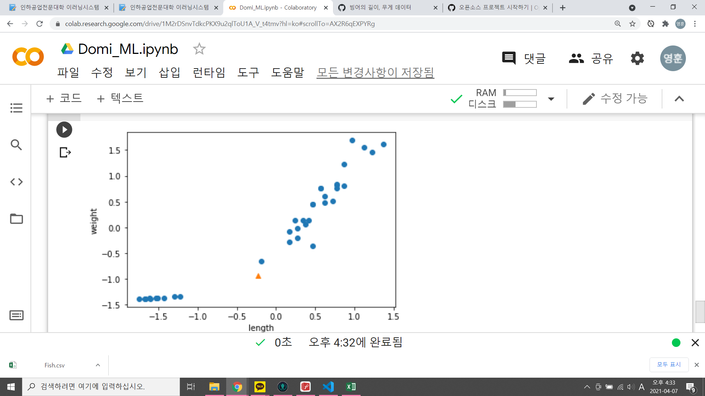

# 데이터 전처리
1. 표준 점수(Z 점수)로 바꾸기
- Z Score = (특성 - 평균)/표준편차
- 표준값 z는 원 수치인 x가 평균에서 얼마나 떨어져 있는지를 나타냄, 음수이면 평균 이하, 양수이면 평균 이상
- 표준점수 계산은 평균을 빼고 표준편차로 나누어줌.
```python
mean = np.mean(train_input, axis=0)
std = np.std(train_input, axis=0)
print(mean, std)
train_scaled = (train_input - mean) / std
print(train_scaled)

new = ([25, 150] - mean) /std
plt.scatter(train_scaled[:,0], train_scaled[:,1])
plt.scatter(new[0], new[1], marker='^')
plt.xlabel('length')
plt.ylabel('weight')
plt.show()
# scale은 모든데이터를 일정한 비율의 거리로 떨어지도록 그래프를 배정한다. 
# 모든 데이터를 표준값 z는 원 수치인 x가 평균에서 얼마나 떨어져 있는지를 나타냄
# 음수이면 평균 이하, 양수이면 평균 이상.
```

- 전처리 데이터에서 모델 훈련.
2. 넘파이의 브로드캐스팅(broadcasting)
- 배열크기(36,2)행렬 - (1,2)행렬 = (36,2)행렬
