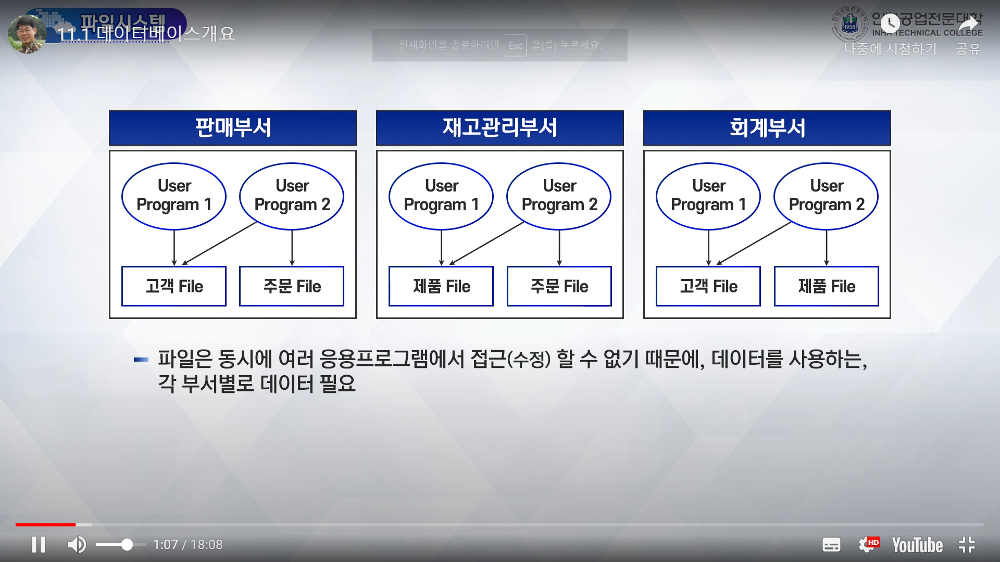
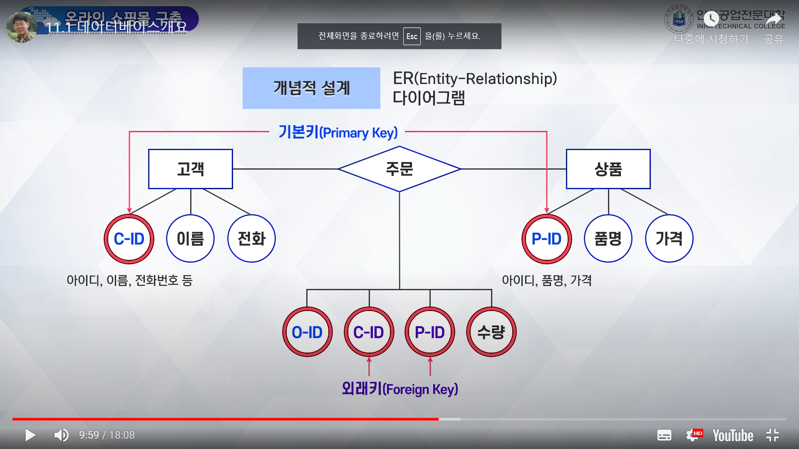
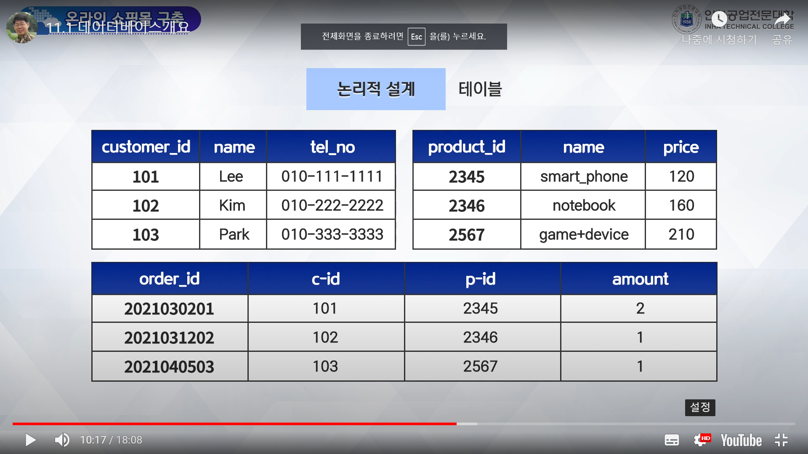
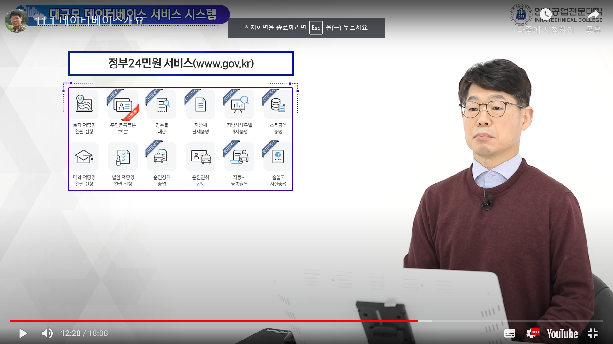
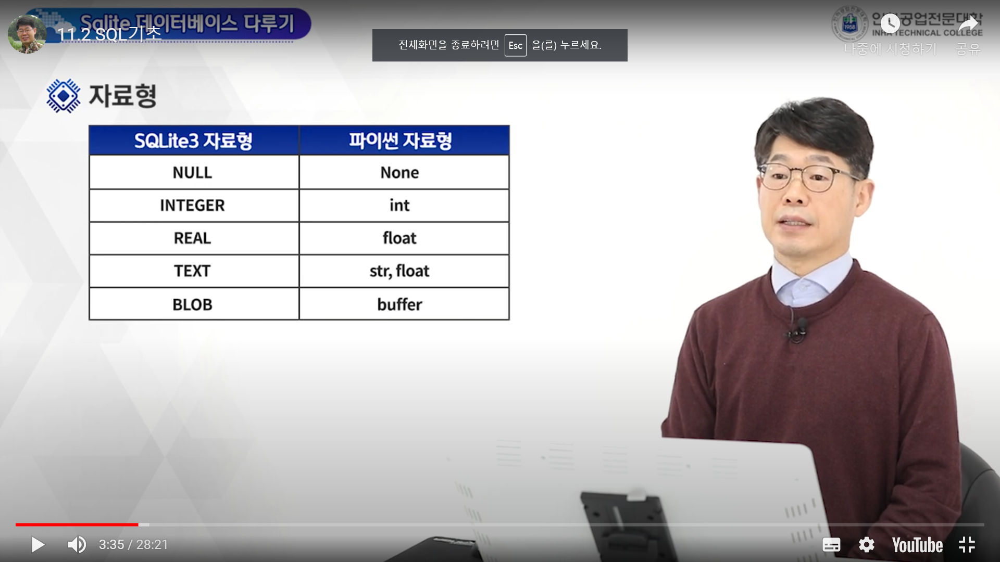

# 데이터베이스 개요

- 파일은 동시에 여러 응용프로그램에서 접근할 수 없기 때문에, 데이터를 사용하는, 각 부서별로 데이터 필요
- 데이터 중복성이 발생할 수 없음.
- 주문 후 다시 취소가 되었을 경우, 판매/ 재고 관리 부서의 주문 파일에 동시에 업데이트가 되어야함.
- 응용프로그램이 별도로 있다 보니, 시차나 절차에 따라 불일치가 있을 수 있으며, 이로 인해 여러 문제를 발생시킴.
- 파일은 응용 프로그램과 데이터 간에 상호 의존성 존재 - > 데이터 종속성
- 파일의 구조 변경:<br>
처음 설계 시에는 없었던, 고객의 등급에 필드를 추가해야 한다고 하면, 고객 파일을 사용하고 있는 모든 응용프로그램 수정
- 데이터 중복성과 종속성으로 인한 문제점<br>
## 문제점 : 일관성, 보안성, 경제성, 효율성<br>
- 일관성 : 
여러 개의 데이터가 모두 하나의 사실만을 나타낸다면 논리적으로 그 내용이 모두 동일하지만, 데이터 중복이 있으면, 그 동일성을 유지하기가 어려워
비효율적임
- 보안성 :
데이터가 중복된다면 모두 같은 수준의 보안을 유지하기가 어려움.<br>
인가되지 않은 변경에 대한 데이터 무결성(Integrity)을 유지하기 어려움
- 경제성 : 데이터가 중복되면 저장되면 추가적인 저장 공간이 필요해 비용이 늘어남
- 효율성 : 하나의 데이터 파일을 여러 응용 프로그램이 공동으로 사용하더라도, <br>
한 프로그램이 데이터 파일을 사용하는 동안에는 다른 응용 프로그램이 그 데이터 파일에 접근할 수 없음.
- 파일시스템의 문제점을 해결하기 위해 데이터베이스 탄생

## 데이터베이스 관리 시스템(DBMS)
### RDBMS(관계형 DBMS)
1. 종류
- Oracle(상업용 1위 DBMS)
- MSSQL
- MariaDB(오픈소스 DBMS)
- SQLite(응용프로그램 안에 DB를 넣어서 사용하는 가벼운 데이터베이스) # 스마트폰에서도 사용함.

2. 설명
- 테이블 형태로 정보 표현
- 데이터베이스 스키마<br>:
데이터베이스의 구조와 제약조건에 관해 전반적인 명세
- 테이블간의 관계를 나타내는 설계도<br>:
개체 - 관계 다이어그램 (ERD; Entity-Relationship Diagram)

### 테이블
- 정보를 쉽게 이해할 수 있는 표현 방식
- 테이블에는 행을 구분하는 기본키(Primary Key)속성이 있어야함.

### 온라인 쇼핑몰 구축
1. 요구사항 수집 분석
2. 모델링(추상화)
- 개념적 설계(ER-다이어그램)

- 논리적 설계(테이블)

- 물리적 설계(SQL로 테이블 생성)
코딩을 위한 물리적 설계 단계
```SQL
CREATE TABLE customer(
    customer_id INTEGER NOT NULL PRIMARY KEY,
    name TEXT NOT NULL,
    ten_no TEXT NOT NULL
)
CREATE TABLE product(
    product_id INTEGER NOT NULL PRIMARY KEY,
    name TEXT NOT NULL,
    price INTEGER NOT NULL
)
```

## 대규모 데이터베이스 서비스 시스템
1. 정부24민원 서비스(www.gov.kr)



## 구조적 질의어(SQL; Structured Query Language)
1. 국제적인 표준 : 모든 DBMS에서 공통으로 사용되는 언어.
2. 데이터 정의어(DDL)
- 데이터베이스 전체 골격을 결정하는 생성, 수정, 삭제
- 데이터베이스 관리자 또는 설계자가 사용
- CREATE, DROP, ALTER, TRUNCATE
3. 데이터 조작어(DML)
- 테이블에 데이터를 조회, 삽입, 수정, 삭제
- SELECT, INSERT, UPDATE, DELETE
4. 데이터 제어어(DCL)
- 데이터베이스 사용자 접근 권한 지정과 변경 완료 및 복구
- COMMIT, ROLLBACK, GRANT

## 데이터베이스 다루기
### CRUD(Create Read Update Delete):
- 데이터를 다루는 프로그램은 모두 CRUD조건을 충족해야한다.
1. 데이터베이스 생성(Connect)
2. 테이블 생성 (Create)
3. 테이블에 데이터 입력(Insert)
4. 테이블에 데이터 조회(Select)
5. 테이블에 데이터 수정(Update)
6. 테이블에 데이터 삭제(Delete)

### Sqlite3 DB 생성 및 입력
1. 데이터베이스 연결 
- 연결자("DB이름") = sqlite3.connect
2. 커서 생성
- 커서 : 데이터베이스에 SQL문을 실행 또는 실행된 결과를 돌려받는 통로
- 커서이름 = 연결자.cusor()
3. 테이블 만들기
- 커서이름.execute("CREATE TABLE문")
4. 데이터 입력(반복)
- 커서이름.execute("INSERT문")
5. 입력한 데이터 저장
- 연결자.commit()
6. 데이터베이스 닫기
- 연결자.close()

### Sqlite3 테이블 조회
1. 데이터베이스 연결
- 연결자("DB이름") = sqlite3.connect
2. 커서 생성
- 커서이름 = 연결자.cusor()
3. 데이터 조회("SELECT문")
- 커서이름.execute
4. 조회한 데이터 출력(반복)
- 커서이름.fetchone()
5. 데이터 베이스 닫기
- 연결자.close()

## Sqlite 데이터베이스 다루기
### Connection 클래스
1. 메서드
- Connection.cursor() : Cursor 객체 생성
- Connection.commit() : 현재 트랜잭션의 변경내역을 DB에 반영(commit)함
- Connection.rollback() : 가장 최근의 Commit() 이후 지금까지 작업한 내용에 대해서 되돌림.
- Connection.close() : DB연결을 종료
- Connection.iolation_level : 트랜잭션의 격리 수준(Isolation level)을 확인/설정
cursor() : 데이터베이스의 SQL문을, SQL문을 실행하거나 또는 실행된 결과를 돌려받는 통로

### Cursor 클래스
1. 메서드
- Cursor.execute(wql[,parameters]) : SQL 문장 실행
- Cursor.executemany(sql, seq_of_parameters) : 동일한 SQL 문장을 파라미터만 변경하며 수행
- Cursor.executescript(sql_script) : 세미콜론으로 구분된 연속된 SQL문장 수행
- Cursor.fetchone() : 조회된 결과(Record Set)로부터 데이터 1개를 반환<br>
한 줄을 읽고 나면 커서가 다음 줄을 가리키고 있으므로 다음 줄을 읽고 싶으면 또 fetchone() 해주면 됨.
- Cursor.fetchmany([size=cursor.arraysize]) : 조회된 결과로부터 입력받은 Size만큼의 데이터를 리스트 형태로 반환
- Cursor.fetchall() : 조회된 결과 모두를 리스트 형태로 반환
2. 자료형

(SQLite3)CREATE TABLE students(no integer, name text, grade integer)
(Python)CREATE TABLE students(no int, name str, grade int)
(Python)CREATE TABLE students(no int, name char(20), grade int)

## Sqlite 데이터베이스 다루기
```python
import os
import shutil
print(os.listdir())
import sqlite3
con = sqlite3.connect('test.db')
cur = con.cursor()
sql = "CREATE TABLE IF NOT EXISTS students(no int, name str, grade float)"
cur.execute(sql)
con.commit()
con.close()
print(os.listdir())
print("con", con)
print("cur", cur)
```
- 실제 업무에서 대부분의 SQL 문장에는 동적으로 데이터 값을 입력해야 하는 경우가 많은데, 자리표시자로 ?(물음표)를 사용

```python
import sqlite3
con = sqlite3.connect('test.db')
cur = con.cursor()

sql = "INSERT INTO student VALUES (1000, '신입생',3.5)"
cur.execute(sql)

data = ((1001, '노영훈', 4.3), (1002,'홍길동', 3.5), (1003,'유재석',4.1))
sql = "INSERT INTO student VALUES (?,?,?)"
cur.executemany(sql,data)

con.commit()
con.close()

```
```python
import os
import shutil
print(os.listdir())
import sqlite3
con = sqlite3.connect('test.db')
cur = con.cursor()
sql = "CREATE TABLE IF NOT EXISTS students(no int, name str, grade float)"
cur.execute(sql)
con.commit()
con.close()
print(os.listdir())
print("con", con)
print("cur", cur)


con = sqlite3.connect('test.db')
cur = con.cursor()
sql = "INSERT INTO students VALUES (1000, '신입생', 3.5)"
cur.execute(sql)

data = ((1001, '노영훈', 4.3), (1002,'홍길동', 3.5), (1003,'유재석',4.1))
sql = "INSERT INTO students VALUES (?,?,?)"
cur.executemany(sql,data)


con.commit()
con.close()

con = sqlite3.connect('test.db')
cur = con.cursor()
sql = "SELECT * FROM students"
cur.execute(sql)
row = cur.fetchone()
while row !=None:
  print( row )
  row = cur.fetchone()
sql = "SELECT * FROM sqlite_master"
cur.execute(sql)
row = cur.fetchone()
print(row)
con.close()

```
- 조회된 데이터를 한번에 모두 읽어서 처리 => fetchall()함수 이용
- abs(x) : 절대값을 반환
- length(x) : 문자열의 길이를 반환
- lower(x) : 소문자로 변환해서 반환
- upper(x) : 대문자로 변환해서 반환
- min() : 최소값을 반환
- max() : 최대값을 반환
- random(*) : 임의의 정수를 반환
- count(x) : NULL이 아닌 튜플의 개수를 반환
- count(*) : 튜플의 개수를 반환
- sum(x) : 합을 반환