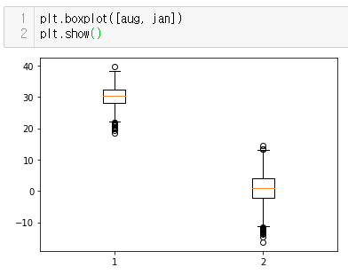

# 데이터 분석 기초

1. boxplot()
2. pandas()
- 엑셀 데이터 읽기
- 데이터 결합
- 필요한 데이터 컬럼 추가
- 각종 통계량 파악
- 데이터 집계

3. 웹 크롤링기초

## 상자 그래프(box plot)

1. 데이터에서 얻어낸 최대값, 최소값, 상위 1/4, 2/4(중앙), 3/4에 위치한 값을 보여주는 그래프
2. 장점 : 데이터 분포가 한 눈에 보임
3. 상자 그래프로 데이터 표현하는 방법.
- randint() 함수를 사용하여 임의의 데이터 만들기 : 1 ~1000 내의 정수
- 만들어진 데이터로 상자 그래프 작성: plt.boxplot() 함수 사용만들어진 데이터로 상자 그래프 작성: plt.boxplot() 함수 사용

4. 서울 최고 기온 데이터 나타내기

- 히스토그램 그릴 때 작성했던 코드와 대부분 동일
- hist() 대신 boxplot()으로 지정.

5. 이상치(outlier)

- 상자 그래프 위, 아래에 그려진 동그라미로 표현
- 다른 수치에 비해 너무 크거나 작은 값을 자동으로 나타냄
- 8월과 1월의 최고 기온 데이터를 원소로 하는 리스트를 상자 그래프로 나타내면



## pandas

1. 가장 많이 접하는 데이터 형태
- 엑셀과 같은 스프레드시트
- 로우(row, 행), 컬럼(column, 열)으로 구성된 테이블 형태
- 판다스는 테이블 형태의 데이터를 쉽게 다룰 수 있는 파이썬 라이브러리

2. 엑셀 데이터 불러오기

- read_excel() 사용
- sample_1.xlsx 파일 특징
    - 1행 : 해당데이터의 제목, 분석에 불필요한 정보
    - 2행 : 4개의 열이름 중 국적코드, 성별, 입국객수 사용
    - 3~8행 : 분석하고자 하는 데이터 열이름에 맞춰구성
    - 9~10행 : 총합계와 전년동기라는 요약정보로 구성, 불필요 정보

3. 데이터 구성 확인

- sample_1.info() : 데이터의 요약 정보 확인

4. 기초 통계량 확인

- sample_1.describe()
    - 숫자형 원소에 대한 여러가지 통계량 출력 함수
    - 여러 가지 통계량 호출

    [Sample_1.describe](https://www.notion.so/49b76055aba94ec598ac9d27b2c929fb)

5. 데이터 선택 - 컬럼 기준

- 원하는 부분만 선택하는 방법
- 입국객수 컬럼만 선택하여 확인
- 국적코드, 입국객수 컬럼 선택하여 확인

## 데이터 집계

1. pivot_table() 사용
2. 피벗 테이블
    - 기존 데이터의 컬럼을 재구성해서 데이터에 대한 통계를 한눈에 파악할 수 있게 정리한 표
3. 피벗 기능을 이용하면 데이터를 원하는 형태로 손쉽게 집계

## 셀레니움 설치
```python
# 미설치시
! pip install selenium
from selenium import webdriver
# webdriver는 chrome => 도움말 => 정보에 들어가 버전을 확인한뒤 버전에 맞는 driver를 다운받는다.
driver = webdriver.Chrome('chromedriver.exe') # JupyterNote에 설치
url = 'https://www.daum.net'
driver.get(url)
```