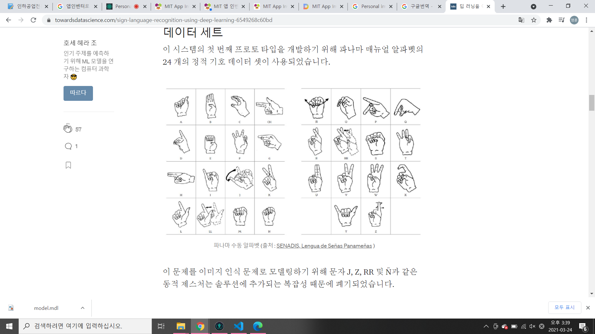

# 아이디어 탐색

# 모델 설계

# 구현
- UI
- 기능

#
1. 트레이닝 모델 이미지 정하기
2. 기본값으로 Train model
3. 라벨 값에 맞는 이미지 넣어주기
4. 결과

# 앱 화면 설계
- 필요 컴포넌트
1. 결과표시레이블, 수평배치, ImageButton,ToggleCamaraButton, VideoButton, 
classify Image, 
2. WebViwer1  
Toggle Camera
Personalimage Classifier 
카메라

## 수화 이미지

## 모델 선정
1. 모델 아이디어 선정
- 동작 = 수화
- 수화 10개 = 라벨 10개
ㄱ ㄴ ㄷ ㄹ ㅁ ㅂ ㅅ ㅇ ㅈ ㅊ ㅋ ㅍ ㅌ ㅎ
ㅏ ㅑ  ㅓ ㅕ ㅗ ㅛ ㅜ ㅠ ㅡ ㅣ 

라벨당 30장 15장 얼굴(x)/ 15장 얼굴(o)
2. 모델 학습

3. 라벨된 모델에 이미지 붙여보기

4. 결과 확인 => 모델 다운로드

- 카메라 창
- 텍스트 출력창 